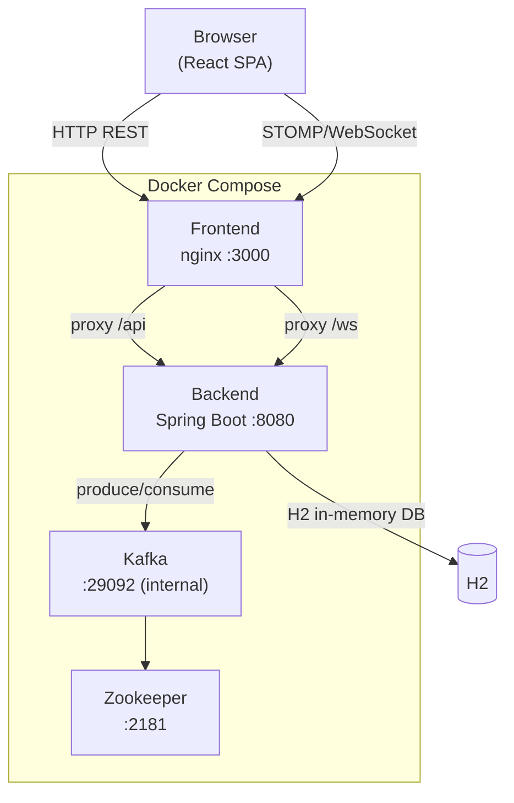
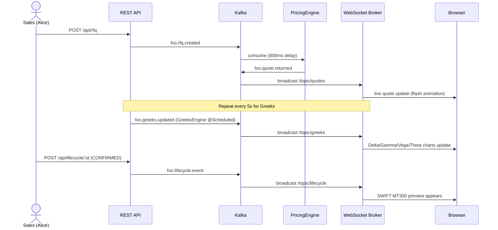
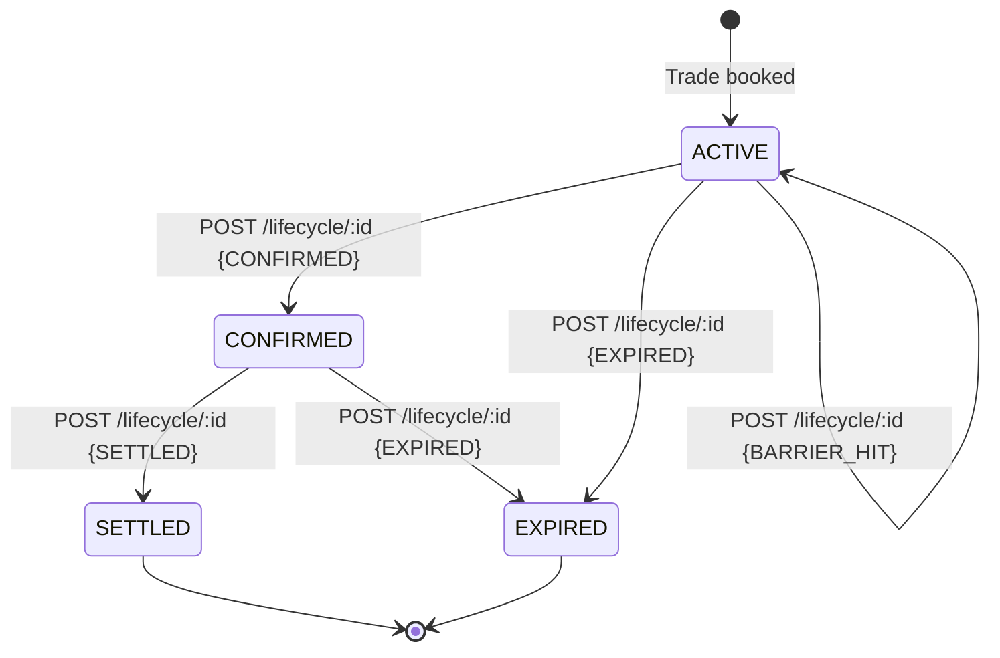
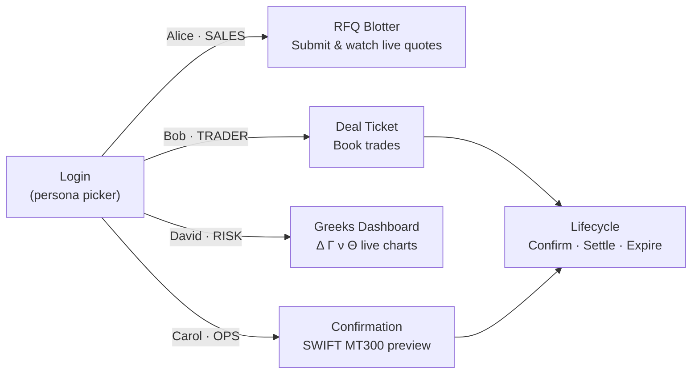

# FXO Trading Platform

A full-stack Foreign Exchange Options (FXO) trading simulation built as a reference implementation for SCB principal engineers. It demonstrates end-to-end trade lifecycle — from client RFQ through pricing, booking, Greeks monitoring, confirmation, and settlement — using event-driven architecture.

---

## Workspace layout

```
fxo-trading/
├── backend/              Spring Boot 3.2 · Java 21 · Maven
├── frontend/             React 18 · TypeScript · Vite
└── docker-compose.yml    Zookeeper + Kafka + backend + frontend
```

This workspace is part of the `my-learnings-cheatsheets` npm monorepo. The sibling `cheatsheet/` workspace hosts the static D&FX reference SPA.

---

## System architecture



---

## Event flow



---

## Trade lifecycle state machine



---

## Role-based screens



---

## Quick start

### Full stack (Docker)

```bash
cd fxo-trading
docker compose up --build
```

| Service  | URL                          |
|----------|------------------------------|
| Frontend | http://localhost:3000        |
| Backend  | http://localhost:8080        |
| H2 console | http://localhost:8080/h2-console |

### Development (without Docker)

Start Kafka locally (or use a cloud broker), then:

```bash
# Terminal 1 — backend
cd fxo-trading/backend
KAFKA_BOOTSTRAP_SERVERS=localhost:9092 mvn spring-boot:run

# Terminal 2 — frontend (dev server with HMR)
cd fxo-trading/frontend
npm install
npm run dev        # → http://localhost:5174
```

The Vite dev server proxies `/api` and `/ws` to `localhost:8080` automatically.

### From the monorepo root

```bash
npm run dev:fxo      # starts frontend dev server
npm run build:fxo    # production build of frontend
```

---

## Test personas

| ID   | Name         | Role       | Landing page        |
|------|--------------|------------|---------------------|
| U001 | Alice Chen   | SALES      | RFQ Blotter         |
| U002 | Bob Kumar    | TRADER     | Deal Ticket         |
| U003 | Carol White  | OPERATIONS | Confirmation & SWIFT|
| U004 | David Park   | RISK       | Greeks Dashboard    |

No passwords — mock authentication via `POST /api/auth/login { userId }`.

---

## Sub-workspace docs

- [Backend →](./backend/README.md) — Spring Boot, Kafka topics, REST API reference, entity model
- [Frontend →](./frontend/README.md) — React app structure, screens, WebSocket integration
