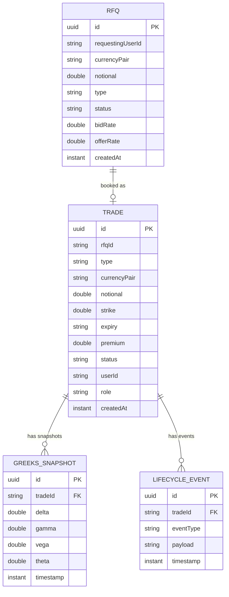
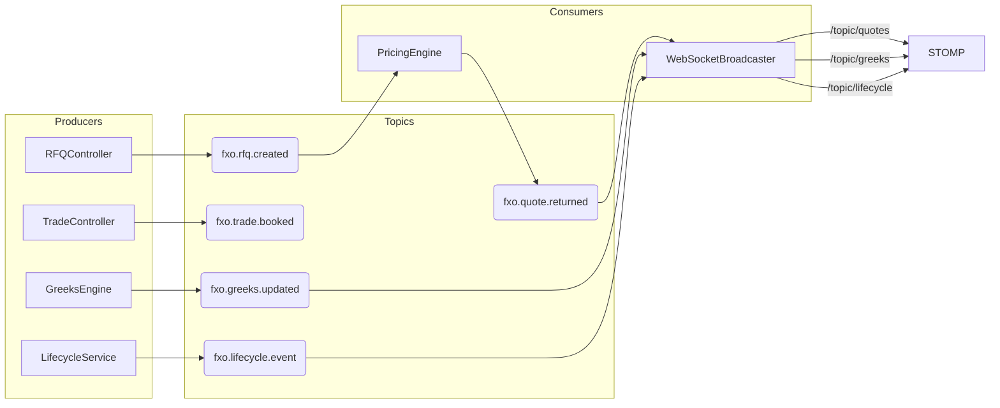

# FXO Backend

Spring Boot 3.2 service providing the REST API, Kafka event pipeline, scheduled Greeks computation, and STOMP WebSocket broadcasting for the FXO Trading Platform.

---

## Tech stack

| Concern        | Library / Version                          |
|----------------|--------------------------------------------|
| Framework      | Spring Boot 3.2.3, Java 21                |
| Persistence    | Spring Data JPA + H2 (in-memory)          |
| Messaging      | Spring Kafka 3.1 (Confluent Kafka 7.6)    |
| WebSocket      | Spring WebSocket + STOMP over SockJS       |
| Build          | Maven 3.9, multi-stage Docker build        |
| Observability  | Spring Actuator (`/actuator/health`)       |
| Test           | JUnit 5 + MockMvc + EmbeddedKafka         |

---

## Package structure

```
com.scb.fxo/
├── FxoApplication.java          @SpringBootApplication + @EnableScheduling
├── config/
│   ├── CorsConfig.java          Allows all origins (dev)
│   ├── KafkaConfig.java         Topic bean declarations
│   ├── WebSocketConfig.java     STOMP endpoint /ws, broker /topic
│   └── DataSeeder.java          Seeds 3 trades + 2 RFQs on startup
├── domain/                      JPA entities + enums
│   ├── Trade.java               Core trade entity
│   ├── RFQ.java                 Request-for-quote entity
│   ├── GreeksSnapshot.java      Point-in-time Greeks reading
│   ├── LifecycleEvent.java      Audit trail of state transitions
│   ├── User.java                Hardcoded personas (no DB table)
│   ├── TradeType.java           VANILLA_CALL | VANILLA_PUT | NDF | COLLAR
│   ├── TradeStatus.java         ACTIVE | CONFIRMED | SETTLED | EXPIRED
│   ├── RFQStatus.java           PENDING | QUOTED | BOOKED
│   └── LifecycleEventType.java  CONFIRMED | BARRIER_HIT | EXPIRED | SETTLED
├── dto/                         Request / response payloads
├── repository/                  Spring Data JPA interfaces
├── service/
│   ├── PricingEngine.java       Kafka consumer → computes bid/offer
│   ├── GreeksEngine.java        @Scheduled every 5s → mock sinusoidal Greeks
│   ├── LifecycleService.java    State transitions + SWIFT MT300 payload
│   ├── WebSocketBroadcaster.java Kafka → STOMP /topic/* bridge
│   └── KafkaPublisher.java      Thin wrapper around KafkaTemplate
└── controller/
    ├── AuthController.java      POST /api/auth/login
    ├── UserController.java      GET  /api/users
    ├── RFQController.java       POST/GET /api/rfq
    ├── TradeController.java     POST /api/trade · GET /api/trades
    ├── GreeksController.java    GET  /api/greeks/:tradeId
    └── LifecycleController.java POST/GET /api/lifecycle/:tradeId
```

---

## Entity model



---

## Kafka topics



---

## REST API reference

### Auth

| Method | Path              | Body                    | Response         |
|--------|-------------------|-------------------------|------------------|
| POST   | `/api/auth/login` | `{ "userId": "U001" }`  | `User` or 401    |

### Users

| Method | Path         | Response      |
|--------|--------------|---------------|
| GET    | `/api/users` | `User[]`      |

### RFQ

| Method | Path          | Body / Params           | Response    |
|--------|---------------|-------------------------|-------------|
| POST   | `/api/rfq`    | `RFQRequest`            | `RFQ`       |
| GET    | `/api/rfq`    | —                       | `RFQ[]`     |
| GET    | `/api/rfq/:id`| —                       | `RFQ`       |

`RFQRequest`: `{ requestingUserId, currencyPair, notional, type }`

### Trade

| Method | Path                   | Body / Params          | Response   |
|--------|------------------------|------------------------|------------|
| POST   | `/api/trade`           | `TradeRequest`         | `Trade`    |
| GET    | `/api/trade/:id`       | —                      | `Trade`    |
| GET    | `/api/trades`          | `?userId=U001`         | `Trade[]`  |

`TradeRequest`: `{ rfqId?, type, currencyPair, notional, strike, expiry, premium, userId, role }`

### Greeks

| Method | Path                        | Response              |
|--------|-----------------------------|-----------------------|
| GET    | `/api/greeks/:tradeId`      | latest `GreeksSnapshot` |
| GET    | `/api/greeks/history/:tradeId` | last 20 snapshots  |

### Lifecycle

| Method | Path                    | Body                        | Response          |
|--------|-------------------------|-----------------------------|-------------------|
| POST   | `/api/lifecycle/:tradeId` | `{ "eventType": "CONFIRMED" }` | `LifecycleEvent` |
| GET    | `/api/lifecycle/:tradeId` | —                          | `LifecycleEvent[]` |
| GET    | `/api/lifecycle`        | —                           | `LifecycleEvent[]` |

Valid `eventType` values: `CONFIRMED`, `BARRIER_HIT`, `EXPIRED`, `SETTLED`

### Actuator

| Path                | Description     |
|---------------------|-----------------|
| `/actuator/health`  | Liveness check  |

---

## WebSocket (STOMP)

Connect endpoint: `ws://localhost:8080/ws` (SockJS fallback at `/ws`)

| Topic               | Payload          | Trigger                          |
|---------------------|------------------|----------------------------------|
| `/topic/quotes`     | `RFQ`            | After PricingEngine prices an RFQ |
| `/topic/greeks`     | `GreeksSnapshot` | Every 5 seconds per active trade  |
| `/topic/lifecycle`  | `LifecycleEvent` | On any lifecycle state transition |

---

## Configuration

Key properties in `src/main/resources/application.yml`:

| Property | Default | Override env var |
|---|---|---|
| `server.port` | `8080` | — |
| `spring.kafka.bootstrap-servers` | `localhost:9092` | `KAFKA_BOOTSTRAP_SERVERS` |
| `spring.jpa.hibernate.ddl-auto` | `create-drop` | — |
| `spring.h2.console.enabled` | `true` | — |

H2 console: http://localhost:8080/h2-console  
JDBC URL: `jdbc:h2:mem:fxodb`

---

## Build & run

```bash
# Compile
mvn compile

# Run tests (EmbeddedKafka, no external broker needed)
mvn test

# Run locally (requires Kafka at localhost:9092)
mvn spring-boot:run

# Production jar
mvn package -DskipTests
java -jar target/fxo-trading-0.0.1-SNAPSHOT.jar

# Docker image
docker build -t fxo-backend .
docker run -p 8080:8080 -e KAFKA_BOOTSTRAP_SERVERS=kafka:29092 fxo-backend
```

---

## Seeded data

On startup `DataSeeder` inserts:

| # | Type         | Pair    | Notional  | Strike | Expiry     | User  |
|---|--------------|---------|-----------|--------|------------|-------|
| 1 | VANILLA_CALL | USD/INR | 1,000,000 | 84.00  | 2025-03-31 | U001  |
| 2 | VANILLA_PUT  | EUR/USD | 500,000   | 1.08   | 2025-06-30 | U002  |
| 3 | NDF          | GBP/USD | 2,000,000 | 1.26   | 2025-09-30 | U001  |
