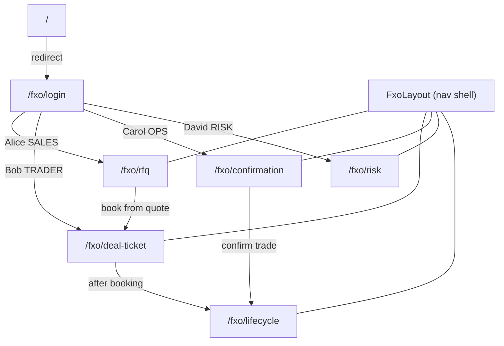
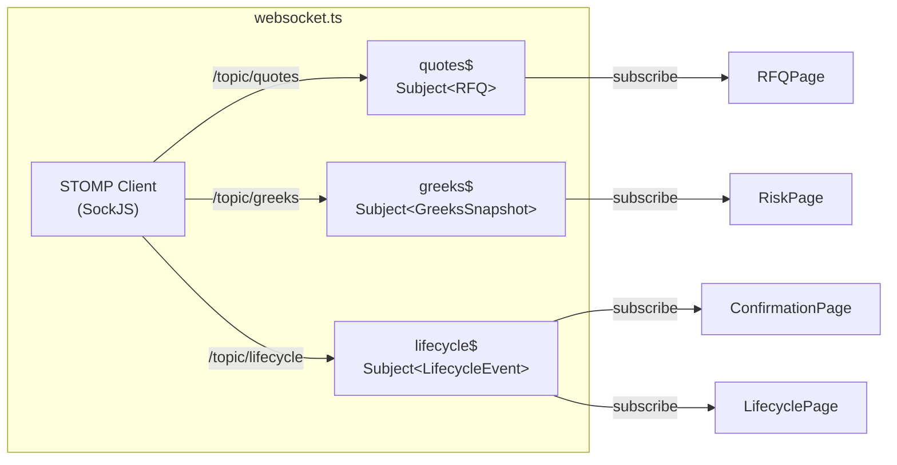

# FXO Frontend

React 18 single-page application providing role-based trading screens with real-time data via STOMP/WebSocket. Built with Vite + TypeScript + RxJS.

---

## Tech stack

| Concern        | Library / Version                        |
|----------------|------------------------------------------|
| UI framework   | React 18, React Router v6 (BrowserRouter)|
| Build          | Vite 5, `@vitejs/plugin-react-swc`       |
| Language       | TypeScript 5 (strict mode)               |
| Real-time      | `@stomp/stompjs` + `sockjs-client` + RxJS 7|
| Charts         | Recharts 2                               |
| Styling        | CSS custom properties (dark theme)       |
| Linting        | ESLint 8 + `@typescript-eslint` + `react-hooks` |
| Container      | nginx alpine (serves built SPA + proxies)|

---

## App structure

```
src/
├── main.tsx                  Entry point
├── App.tsx                   BrowserRouter + AuthProvider + all Routes
├── types/
│   └── index.ts              Shared TypeScript interfaces & enums
├── contexts/
│   └── AuthContext.tsx       useAuth() hook + AuthProvider (sessionStorage)
├── services/
│   ├── api.ts                fetch wrapper for all REST endpoints
│   └── websocket.ts          STOMP client + RxJS Subjects (quotes$, greeks$, lifecycle$)
├── hooks/
│   └── useObservable.ts      Generic hook: Observable<T> → React state
├── styles/
│   ├── variables.css         CSS custom property tokens (dark theme)
│   └── globals.css           Reset, base styles, flash keyframe animation
├── components/
│   ├── StatusBadge/          Coloured pill for Trade/RFQ status
│   └── TradeBlotter/         Sortable trade table used across pages
└── routes/fxo/
    ├── layout/FxoLayout      Top nav, role chip, logout, WebSocket lifecycle
    ├── login/LoginPage       4 persona cards (mock auth)
    ├── rfq/RFQPage           RFQ submission form + live quote feed
    ├── deal-ticket/          Trade booking form + my-trades blotter
    ├── risk/RiskPage         Greeks dashboard (4 live Recharts charts)
    ├── confirmation/         SWIFT MT300 preview + lifecycle event log
    └── lifecycle/            Trade cards + confirm/settle/expire actions
```

---

## Routing



---

## WebSocket data flow



Subjects are module-level singletons. Pages subscribe in `useEffect` and unsubscribe on unmount, so only one STOMP connection is maintained for the session (opened in `FxoLayout` on login, closed on logout).

---

## Screen reference

### Login (`/fxo/login`)

```
┌─────────────────────────────────────────────────────┐
│   ⬡ FXO Trading Platform                           │
│   Select a test persona to explore the system       │
│                                                     │
│  ┌─────────────┐  ┌─────────────┐                  │
│  │ SALES       │  │ TRADER      │                  │
│  │ Alice Chen  │  │ Bob Kumar   │                  │
│  │ U001        │  │ U002        │                  │
│  │ Submit RFQs │  │ Book trades │                  │
│  └─────────────┘  └─────────────┘                  │
│  ┌─────────────┐  ┌─────────────┐                  │
│  │ OPERATIONS  │  │ RISK        │                  │
│  │ Carol White │  │ David Park  │                  │
│  │ U003        │  │ U004        │                  │
│  │ Confirm …   │  │ Monitor …   │                  │
│  └─────────────┘  └─────────────┘                  │
└─────────────────────────────────────────────────────┘
```

Calls `POST /api/auth/login { userId }` → stores `User` in `sessionStorage`.

---

### RFQ Blotter (`/fxo/rfq`)

```
┌──────────────┬──────────────────────────────────────┐
│ New RFQ      │ Live RFQ Feed                        │
│              │                                      │
│ Pair   [▾]   │ ID       Pair   Type  Notional  Bid  │
│ Type   [▾]   │ a1b2c3d  USD/INR CALL 1,000,000 83.08│
│ Notional     │ ↑ flashes yellow when quote arrives  │
│              │                                      │
│ [Submit RFQ] │                                      │
└──────────────┴──────────────────────────────────────┘
```

- Submits to `POST /api/rfq`
- Kafka → PricingEngine (800ms) → `quotes$` → row updates with flash animation

---

### Deal Ticket (`/fxo/deal-ticket`)

```
┌───────────────────────────────┬──────────────────────┐
│ Book Trade                    │ My Trades            │
│                               │                      │
│ Pair [▾]  Type [▾]            │ ID  Type  Pair  ...  │
│ Notional  Strike              │ ──────────────────── │
│ Expiry    Premium (auto)      │ (trade blotter)      │
│ RFQ ID (optional)             │                      │
│                               │                      │
│ [Book Trade]                  │                      │
└───────────────────────────────┴──────────────────────┘
```

Premium is calculated client-side as `notional × 1.5%` (0 for COLLAR). Calls `POST /api/trade`.

---

### Greeks Dashboard (`/fxo/risk`)

```
┌──────────────────────────────────────────────────────┐
│ Greeks Dashboard      Trade [a1b2c3d — USD/INR CALL ▾]│
│                                                      │
│  Δ 0.6124   Γ 0.0231   ν 0.1832   Θ −0.0274         │
│                                                      │
│  ┌─────────────┐  ┌─────────────┐                   │
│  │ Delta ──╮   │  │ Gamma ~~    │                   │
│  │         ╰─  │  │             │                   │
│  └─────────────┘  └─────────────┘                   │
│  ┌─────────────┐  ┌─────────────┐                   │
│  │ Vega  /\/\  │  │ Theta ↘     │                   │
│  └─────────────┘  └─────────────┘                   │
└──────────────────────────────────────────────────────┘
```

Charts update every 5s via `greeks$` observable. Last 20 snapshots are kept in state.

---

### Confirmation (`/fxo/confirmation`)

```
┌─────────────────────────┬─────────────────────────────┐
│ Pending Confirmation    │ SWIFT MT300 Preview         │
│                         │                             │
│ a1b2c3d  USD/INR CALL   │ {1:F01SCBLSGSGAXXX…}       │
│ ACTIVE   [Confirm]      │ {2:I300XXXXXXXXXXXXN}       │
│                         │ {4:                         │
│ Lifecycle Events        │ :15A:                       │
│ CONFIRMED  a1b2  12:00  │ :20:A1B2C3D4               │
│                         │ :22A:CONFIRMED              │
│                         │ …                           │
└─────────────────────────┴─────────────────────────────┘
```

Calls `POST /api/lifecycle/:id { eventType: "CONFIRMED" }`. SWIFT MT300 payload is generated server-side and returned in `LifecycleEvent.payload`.

---

### Lifecycle (`/fxo/lifecycle`)

```
┌───────────────────────────────┬──────────────────────┐
│ [ALL] [ACTIVE] [CONFIRMED]…   │ Event Timeline       │
│                               │                      │
│ a1b2c3d · USD/INR CALL  45d   │ ● CONFIRMED a1b2 …  │
│ $1,000,000  [Confirm][Expire] │ ● EXPIRED   f3e4 …  │
│                               │ ● SETTLED   b7c8 …  │
│ f3e4c5d · EUR/USD PUT   12d   │                      │
│ $500,000    [Settle]          │                      │
└───────────────────────────────┴──────────────────────┘
```

Colour-coded countdown: green > 7 days, red ≤ 7 days. Actions only shown for valid next states.

---

## CSS theming

All colours are CSS custom properties defined in `src/styles/variables.css`. Dark mode is the default (no toggle on this app — the cheatsheet sibling has one).

| Token | Dark | Purpose |
|---|---|---|
| `--color-bg` | `#0f1117` | Page background |
| `--color-surface` | `#1a1d27` | Card / panel |
| `--color-surface-2` | `#232636` | Table row alt, inputs |
| `--color-primary` | `#4f9cf9` | Links, active nav, SALES role |
| `--color-success` | `#4caf82` | TRADER role, ACTIVE/CONFIRMED status |
| `--color-warning` | `#f5a623` | OPERATIONS role, PENDING status |
| `--color-danger` | `#e05c5c` | RISK role, EXPIRED status |
| `--color-purple` | `#9b7fe8` | QUOTED status |

---

## Build & dev commands

```bash
# Install dependencies
npm install

# Dev server with HMR (proxies /api and /ws to localhost:8080)
npm run dev          # → http://localhost:5174

# Type check
npx tsc --noEmit

# Lint
npm run lint

# Production build
npm run build        # → dist/

# Preview production build
npm run preview
```

### From the monorepo root

```bash
npm run dev:fxo      # equivalent to npm run dev inside this package
npm run build:fxo    # equivalent to npm run build inside this package
```

---

## Environment / proxy

In development the Vite dev server proxies:

| Prefix | Target              |
|--------|---------------------|
| `/api` | `http://localhost:8080` |
| `/ws`  | `http://localhost:8080` (WS upgrade) |

In production the nginx container handles the same proxy rules (see `nginx.conf`).
